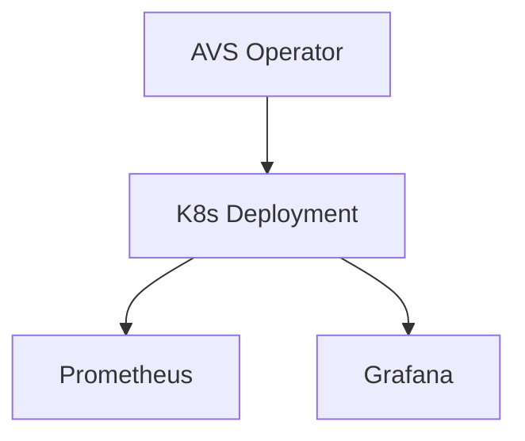

# platform-avs-infrastructure

**Production-inspired Reference Infrastructure Patterns for AVS Operator and Data Availability Workloads on Kubernetes, demonstrating containerized operator, monitoring sidecar, and observability integration.**


## Professional Summary

Reference Docker Compose and Kubernetes Deployment for AVS operator container (port 8080) with Prometheus + Grafana monitoring sidecar. Demonstrates operator + observability co-location. Can integrate with validator operations platforms. Patterns for EigenLayer-style or data availability workloads on k8s.

## Table of Contents

- [Problem Statement](#problem-statement)
- [Why This Exists](#why-this-exists)
- [Solution Overview](#solution-overview)
- [Key Features](#key-features)
- [Architecture](#architecture)
- [Technology Stack](#technology-stack)
- [Repository Structure](#repository-structure)
- [Deployment Workflow](#deployment-workflow)
- [Monitoring & Observability](#monitoring--observability)
- [Security Considerations](#security-considerations)
- [Operational Lessons Learned](#operational-lessons-learned)
- [Screenshots](#screenshots)
- [Roadmap](#roadmap)
- [Business Value](#business-value)
- [Resume Relevance](#resume-relevance)
- [License](#license)

## Problem Statement

AVS (Actively Validated Services) and data availability layers require dedicated operator processes alongside validators. These workloads need reliable deployment, health exposure, and integrated monitoring on Kubernetes without duplicating full validator stacks.

## Why This Exists

Validator operators expanding into AVS or DA need patterns for co-deployed operators with observability. Standalone operator images require sidecar monitoring and k8s manifests. This provides a minimal, integrable reference.

## Solution Overview

Compose runs avs-operator (8080) + Prometheus + Grafana. k8s Deployment manifest for the operator. Architecture diagram. Runbooks. Demonstrates sidecar monitoring pattern for AVS/DA on k8s.

## Key Features

- avs-operator container exposing port 8080
- Docker Compose with avs-operator + Prometheus + Grafana
- k8s Deployment manifest (k8s/avs-deployment.yaml)
- Architecture diagram (Mermaid)
- Monitoring stack integration
- Runbooks and troubleshooting

## Architecture



### Component Breakdown

- **Ingress**: k8s Service on port 8080 for operator; extend with ingress
- **Service**: avs-deployment Service for internal discovery and metrics
- **Storage**: Ephemeral or PVC via k8s (prod)
- **Monitoring**: Prometheus scrape + Grafana for operator health and AVS metrics
- **Deployment flow**: `docker compose up`; `kubectl apply -f k8s/` ; integrate with validator ops platforms

## Technology Stack

- **Operator**: avs-operator container
- **Orchestration**: Kubernetes Deployment + Service
- **Observability**: Prometheus + Grafana
- **Packaging**: Docker Compose

## Repository Structure

```
platform-avs-infrastructure/
├── docker-compose.yml          # avs-operator + prom + grafana
├── k8s/avs-deployment.yaml
├── diagrams/avs-architecture.mmd
├── screenshots/                # avs-architecture.png, monitoring-stack.png, operator-flow.png
├── docs/                       # runbook.md, troubleshooting.md
├── SECURITY.md
├── .github/workflows/ci.yml
└── ROADMAP.md
```

## Deployment Workflow

```bash
git clone https://github.com/blockmalhotra/platform-avs-infrastructure
cd platform-avs-infrastructure
docker compose up
# Kubernetes
kubectl apply -f k8s/avs-deployment.yaml
```

See docs/runbook.md for integration notes.

## Monitoring & Observability

- avs-operator health on exposed port
- Prometheus + Grafana for operator and AVS-specific metrics
- Sidecar pattern for co-located observability

## Security Considerations

- No keys or credentials in default manifests
- CHANGEME values where applicable (see security patterns)
- See SECURITY.md

## Operational Lessons Learned

- Operator sidecars benefit from the same observability stack as validators for unified dashboards.
- Keeping the reference minimal (operator + monitoring only) makes integration with existing validator platforms straightforward.
- Explicit port exposure and Service definitions prevent discovery issues in multi-workload clusters.

## Screenshots

### AVS Architecture & Operator


### Monitoring


## Roadmap

### Completed

- avs-operator + Prometheus/Grafana Compose reference
- k8s Deployment manifest
- Architecture diagram
- Initial CI
- v0.1.0-in-progress tag and portfolio standardization

### In Progress

- Recruiter documentation and consistency
- Runbook coverage

### Planned

- EigenLayer / EigenDA / Avail / Espresso specific examples (patterns only)
- Full validator + AVS co-deployment reference
- Production metrics and alerting rules

## Business Value

Enables teams running validators to extend into AVS/DA with minimal new infrastructure. Sidecar monitoring pattern reuses existing obs stack. Provides starting point for operator health and metrics without full custom development. Supports faster experimentation and productionization of validated services.

## Resume Relevance

This repository demonstrates practical experience with:

- Kubernetes Operations (Deployment, Service, sidecar patterns)
- Observability Integration (Prometheus + Grafana for operators)
- Blockchain Infrastructure Patterns (AVS/DA operator co-location)
- Production Troubleshooting (runbooks, minimal ref for integration)
- DevOps Tooling (Docker, Compose, CI)

## License

MIT License. See [LICENSE](LICENSE).

---

Reference implementation. Evidence from repository code and manifests only. No specific EigenLayer/EigenDA/Avail/Espresso implementations present.
