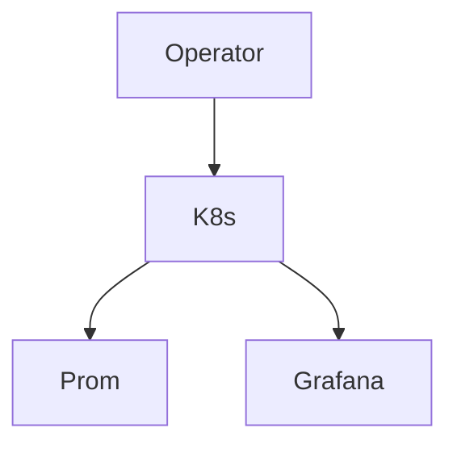

# platform-avs-infrastructure

AVS Operations Platform.

## Problem
AVS operators need k8s infra for EigenLayer with monitoring and workflows.

## Architecture

## Components
K8s, Docker, Monitoring, Validator Ops.

## Quick Start
docker compose up

## Demo
See docker-compose.yml

## Screenshots
screenshots/avs-architecture.png etc.

## Monitoring
Full stack.

## Security
No keys exposed.

## CI/CD
.github/workflows/ci.yml

## Production Deployment
k8s.

## Roadmap
- More AVS.

## Runbooks
docs/runbook.md

## Troubleshooting
docs/troubleshooting.md
