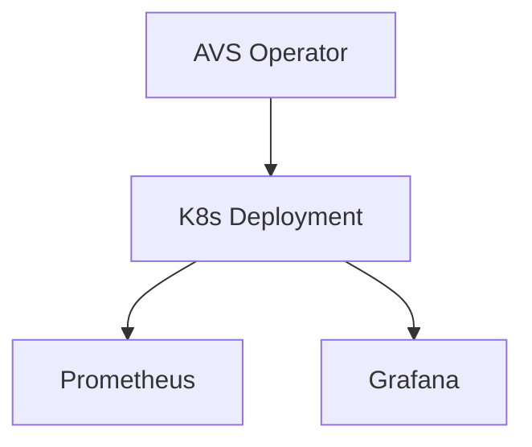
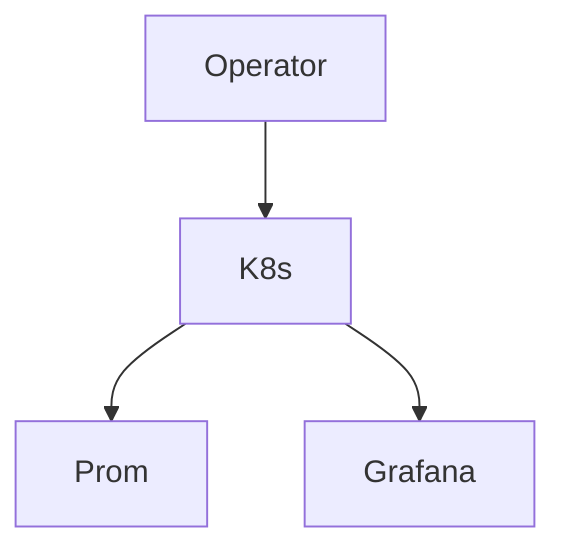

# platform-avs-infrastructure

Reference infrastructure patterns for AVS operator and data availability workloads on Kubernetes, including containerized operator, monitoring sidecar, and observability integration.


**Overview** | [Architecture](#architecture) | [Features](#features) | [Deployment](#deployment) | [Monitoring](#monitoring) | [Security](#security) | [Screenshots](#screenshots)

## Problem Statement

AVS (Actively Validated Services) and data availability layers require dedicated operator processes alongside validators. These workloads need reliable deployment, health exposure, and integrated monitoring on Kubernetes without duplicating full validator stacks.

## Solution

Reference Docker Compose and Kubernetes Deployment manifest an avs-operator container with Prometheus + Grafana sidecar monitoring. The pattern demonstrates operator + observability co-location and can be integrated with validator operations platforms.

## Features

- avs-operator container exposing port 8080
- Docker Compose with avs-operator + Prometheus + Grafana
- k8s Deployment manifest (k8s/avs-deployment.yaml)
- Architecture diagram (Mermaid)
- Monitoring stack integration
- Runbooks and troubleshooting

## Technology Stack

- **Operator**: avs-operator container
- **Orchestration**: Kubernetes Deployment + Service
- **Observability**: Prometheus + Grafana
- **Packaging**: Docker Compose

## Architecture



### Component Breakdown

- **Ingress**: k8s Service on port 8080 for operator; extend with ingress
- **Service**: avs-deployment Service for internal discovery and metrics
- **Storage**: Ephemeral or PVC via k8s (prod)
- **Monitoring**: Prometheus scrape + Grafana for operator health and AVS metrics
- **Deployment flow**: `docker compose up`; `kubectl apply -f k8s/` ; integrate with validator ops platforms

<details>
<summary>Show avs-architecture.mmd</summary>


</details>

## Repository Structure

```
platform-avs-infrastructure/
├── docker-compose.yml          # avs-operator + prom + grafana
├── k8s/avs-deployment.yaml
├── diagrams/avs-architecture.mmd
├── screenshots/                # avs-architecture.png, monitoring-stack.png, operator-flow.png
├── docs/                       # runbook.md, troubleshooting.md
├── SECURITY.md
├── .github/workflows/ci.yml
└── ROADMAP.md
```

## Screenshots

### AVS Architecture & Operator


### Monitoring


## Deployment

```bash
git clone https://github.com/blockmalhotra/platform-avs-infrastructure
cd platform-avs-infrastructure
docker compose up

# Kubernetes
kubectl apply -f k8s/avs-deployment.yaml
```

See docs/runbook.md for integration notes.

## Monitoring

- avs-operator health on exposed port
- Prometheus + Grafana for operator and AVS-specific metrics
- Sidecar pattern for co-located observability

## Security

- No keys or credentials in default manifests
- CHANGEME values where applicable (see security patterns)
- See SECURITY.md

## CI/CD

`.github/workflows/ci.yml`:

- validate: compose config
- build: docker validation

## Roadmap

### Completed

- avs-operator + Prometheus/Grafana Compose reference
- k8s Deployment manifest
- Architecture diagram
- Initial CI
- v0.1.0-in-progress tag and portfolio standardization

### In Progress

- Recruiter documentation and consistency
- Runbook coverage

### Planned

- EigenLayer / EigenDA / Avail / Espresso specific examples (patterns only)
- Full validator + AVS co-deployment reference
- Production metrics and alerting rules

## Lessons Learned

- Operator sidecars benefit from the same observability stack as validators for unified dashboards.
- Keeping the reference minimal (operator + monitoring only) makes integration with existing validator platforms straightforward.
- Explicit port exposure and Service definitions prevent discovery issues in multi-workload clusters.

## License

MIT License. See [LICENSE](LICENSE).

---

**Reference implementation and learning project. Not production deployment.**
