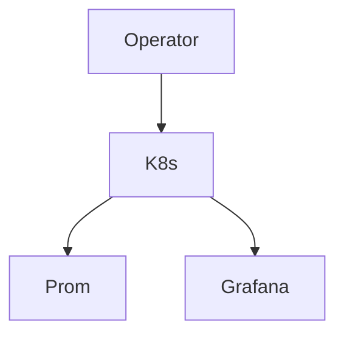

# platform-avs-infrastructure

🚧 Status: In Progress

This repository is currently under active development and should be considered a reference implementation and learning project until a stable release is published.


## Features

- AVS operator reference on k8s for EigenLayer style workloads
- Docker compose with avs-operator + prom/grafana
- k8s deployment manifests
- Monitoring stack integration

## Architecture



### Component Breakdown

- **Ingress**: k8s Service port 8080 for operator; extend with ingress controller
- **Service**: avs-deployment k8s service + internal discovery
- **Storage**: Ephemeral or pvc in prod; config via k8s
- **Monitoring**: Prometheus + Grafana for operator health and AVS metrics
- **Deployment flow**: docker compose for local; kubectl apply -f k8s/ for cluster; integrate with validator ops

## Quick Start

```bash
git clone https://github.com/blockmalhotra/platform-avs-infrastructure
cd platform-avs-infrastructure
docker compose up
```

## Roadmap

### v0.1
- Initial release

### v0.2
- Feature expansion

### v0.3
- Production hardening

### v1.0
- Stable release

## Contributing

See CONTRIBUTING.md

## License

MIT License - see LICENSE file.
